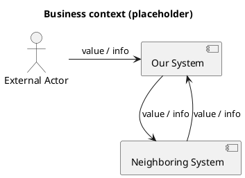
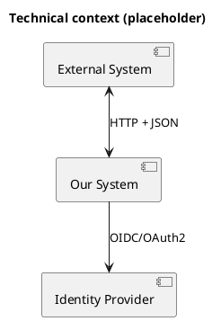

Chapter 3 is the last chapter in the "Why and where" group.
It is where you draw the line between your system and the outside world.

If that line is unclear, failures show up eventually:
unclear responsibilities, failing integrations, and mismatched expectations.

This chapter is split into two views:

- **Business context**: who interacts with the system, and what value or information is exchanged.
- **Technical context**: what interfaces exist, and how integration actually happens.

<!--more-->

## What belongs in chapter 3 (and what does not)

Chapter 3 of an [arc42][ARC42] document answers one question:

> What is inside our system, what is outside, and how do we interact?

What belongs here:

- A clear **inside vs outside** boundary.
- External **business actors** and **neighboring systems** with responsibilities.
- The **direction** of exchanges (who initiates, who responds).
- Examples of **value or data exchanged** (not only APIs: files, emails, manual exports, spreadsheets, SFTP drops).
- The most important **interfaces** (APIs, messaging, files, UI hand-offs, SSO, batch jobs).
- Links to existing interface documentation (OpenAPI/AsyncAPI/specs) if it exists.

What does not belong here:

- Internal building blocks and components (chapter [5][CH5]).
- Runtime scenarios and sequencing (chapter [6][CH6]).
- Deployment layouts (chapter [7][CH7]).
- Technical design details that do not cross the boundary.

> [!NOTE]  
> If there is no separate API documentation, chapter 3 is _the_ place to document your interfaces.
> Even when you can link to OpenAPI or AsyncAPI documents, include 1–2 small sample payloads here.  
> It makes the integration real and readable without forcing people to open a separate spec.

### Diagrams: modeling tool or text-based

Diagrams make chapter 3 click.
You can draw them in a modeling tool like Sparx Enterprise Architect,
but you can also keep them close to the code using text-based diagrams.

I prefer [PlantUML component diagrams][PLANTUML_COMPONENT_DIAGRAMS] for this chapter, because the system boundary and interfaces are easy to read.

Text-based diagrams work well because they are easy to diff, review, and version together with the documentation.

> [!TIP]  
> Use whatever keeps the diagram maintained.  
> A perfect diagram that nobody updates is less useful than a simple one that stays correct.

## The minimum viable version

If you are short on time, aim for this:

1. One business context diagram (or a table) listing the key actors/systems and what they exchange.
2. One technical context diagram (or a table) listing the top interfaces with direction and protocol.
3. For the top 1–3 interfaces: add a short example (sample payload, file format snippet, or message shape).

That is enough to prevent most boundary and integration surprises.

### When this chapter becomes high value

As soon as you have quality goals around availability, latency, or operational continuity,
your interfaces need a bit more than <q>we call API X</q>.

For your top interfaces, add:

- SLA/SLO expectations and support windows
- Failure behavior and fallback procedures
- Retry/idempotency rules
- Rate limits and quotas
- Security and trust boundaries

This is often where the conversation moves from <q>it depends</q> to concrete trade-offs.

## Copy/paste structure (Markdown skeleton)

Use this as a starting point and keep it small.

````md title="03-context-and-scope.md"
## 3. Context and scope

### 3.1 Business context

<Who is outside the system, what value/data is exchanged?>



| External actor / system | Responsibility | Exchange with our system |
| :---------------------- | :------------- | :----------------------- |
| ...                     | ...            | ...                      |

### 3.2 Technical context

<Which technical interfaces exist, and how do we integrate?>



| Peer | Interface | Owner | Direction | Protocol / format | Notes |
| :--- | :-------- | :---- | :-------- | :---------------- | :---- |
| ...  | ...       | ...   | ...       | ...               | ...   |

#### 3.2.1 Interface: <name>

**Purpose:** <why does this interface exist?>  
**Direction:** <A -> B, source of truth?>  
**Link to spec:** <OpenAPI/AsyncAPI link if it exists>

**Examples (recommended):**

<Description>

```json
{ "example": "payload" }
```

**Expectations and exceptions (optional):**

| SLA/SLO | Failure behavior | Retry / idempotency | Fallback / manual procedure |
| :------ | :--------------- | :------------------ | :-------------------------- |
| ...     | ...              | ...                 | ...                         |
````

## Example (Pitstop)

Pitstop is my small demo system for this series.
It is intentionally simple, so the documentation stays shareable.

This is what chapter 3 looks like when filled in.

> ## 3. Context and scope
>
> ### 3.1 Business context
>
> Pitstop sits between planning and the workshop.
> It keeps work orders and status in sync so people stop copying information between tools.
>
> 
>
> | Actor/System                    | Responsibility                     | Exchanges with Pitstop                          |
> | ------------------------------- | ---------------------------------- | ----------------------------------------------- |
> | Customer                        | Brings car, receives updates       | ETA updates (via advisor/portal)                |
> | Service Advisor                 | Manages appointment & expectations | Priority changes, notes, customer communication |
> | Workshop Foreman                | Orchestrates execution             | Assignments, reprioritization                   |
> | Mechanic                        | Performs work                      | Status updates, findings, time spent            |
> | Planning Service                | Owns schedule/time slots           | Appointment import, reschedule suggestions      |
> | Notification Service (optional) | Contact customers                  | SMS/email updates                               |
>
> ### 3.2 Technical context
>
> 
>
> | Peer                            | Interface         | Owner           | Direction     | Protocol/Format | Notes                             |
> | ------------------------------- | ----------------- | --------------- | ------------- | --------------- | --------------------------------- |
> | Planning Service                | Appointments API  | Planning vendor | Inbound       | REST/JSON       | Full import + incremental sync    |
> | Planning Service (optional)     | Webhooks          | Planning vendor | Inbound       | HTTP/JSON       | Push appointment changes          |
> | Planning Service                | Status updates    | Pitstop team    | Outbound      | REST/JSON       | Delay, ready, reschedule proposal |
> | Admin Overview UI               | Work Orders API   | Pitstop team    | Bidirectional | HTTPS/JSON      | RBAC, dashboards                  |
> | Workshop View UI                | Live Updates      | Pitstop team    | Bidirectional | WebSocket/JSON  | Low latency, optimized payloads   |
> | Notification Service (optional) | Notifications API | Pitstop team    | Outbound      | REST/JSON       | Customer updates                  |
>
> ### 3.2.1 Interface: Appointments API
>
> ### 3.2.1.1 Examples
>
> **Appointment imported from planning:**
>
> ```json
> {
>   "appointmentId": "A-10293",
>   "plate": "12-AB-34",
>   "start": "2026-01-12T09:00:00+01:00",
>   "service": "OilChange",
>   "customerRef": "C-4451"
> }
> ```
>
> ### 3.2.2 Interface: Work Orders API
>
> ### 3.2.2.1 Examples
>
> **Workshop update from a mechanic:**
>
> ```json
> {
>   "workOrderId": "WO-7781",
>   "status": "WaitingForParts",
>   "note": "Brake pads not in stock",
>   "updatedBy": "mechanic-17",
>   "updatedAt": "2026-01-12T10:41:00+01:00"
> }
> ```

To browse the full Pitstop arc42 sample, see my [GitHub Gist][PITSTOP_ARC42].

> [!NOTE]  
> Interfaces are not always APIs.  
> Manual exports, emailed files, spreadsheets, SFTP drops, and <q>someone retypes it</q> are also integrations.  
> If information crosses the boundary, document it here.

## Common mistakes I see (and made myself)

1. **Only naming neighbors, without exchanges**  
   A box called <q>CRM</q> is not useful by itself.
   Document what is exchanged and why.

2. **Mixing business and technical context**  
   Business context is about responsibilities and value.
   Technical context is about protocols and integration mechanics.
   Mixing them makes both harder to read.

3. **Treating REST as the only interface**  
   REST is common, but not universal.
   File transfers, messaging, batch jobs, manual steps and spreadsheets all matter.

4. **No ownership**  
   If you do not document who owns an external interface, you will not know who to call when it breaks.

5. **No direction**  
   <q>We integrate with X</q> is vague.
   Who initiates, who is the source of truth, who is allowed to change state?

6. **No examples**  
   Even when you have OpenAPI or AsyncAPI, one small payload example prevents a lot of misunderstandings.

7. **No expectations for critical interfaces**  
   If availability or latency matters, document assumptions:
   SLAs, failure behavior, retry rules, and fallback procedures.

> [!NOTE]
> If an external stakeholder cannot recognize their responsibilities and expectations in this chapter,
> the integration is not documented clearly enough yet.

## Done-when checklist

🔲 The system boundary is clear (inside vs outside).  
🔲 Business actors and neighboring systems are listed with responsibilities.  
🔲 The top interfaces are listed with direction, protocol/format, and owner.  
🔲 The most important integrations have 1–3 small examples (payload, file snippet, message shape).  
🔲 Critical interfaces have expectations (SLA/failure behavior) or are explicitly marked as unknown.

## Next improvements backlog

- Add links to OpenAPI/AsyncAPI documents (or create them if missing).
- Add SLA/SLO and failure behavior for the top 3 interfaces.
- Add a short note about trust boundaries and data classification (if relevant).
- Add examples for non-API integrations (file drop, manual export, batch job) if they exist.
- Review chapter 3 with external stakeholders (planning vendor/team, ops, security) for recognition and correctness.

## Wrap-up

Chapter 3 is where you make expectations explicit.
Most problems show up at the boundary first, so investing in this chapter pays off quickly.

This concludes the "Why and where" group of arc42 chapters.
Next, we move on to the "How is it built and how does it run" group.

Next up: [arc42 chapter 4, "Solution strategy"](/2026/02/09/arc42-chapter-4-solution-strategy/), where we describe the approach and major decisions that guide the design.

[PITSTOP_ARC42]: https://gist.github.com/eNeRGy164/90f63e78d3e528f7b8490538a6781b5f
[ARC42]: https://arc42.org/
[PLANTUML_COMPONENT_DIAGRAMS]: https://plantuml.com/component-diagram
[CH5]: /2026/02/10/arc42-chapter-5-building-block-view/
[CH6]: /2026/02/11/arc42-chapter-6-runtime-view/
[CH7]: /2026/02/16/arc42-chapter-7-deployment-view/
