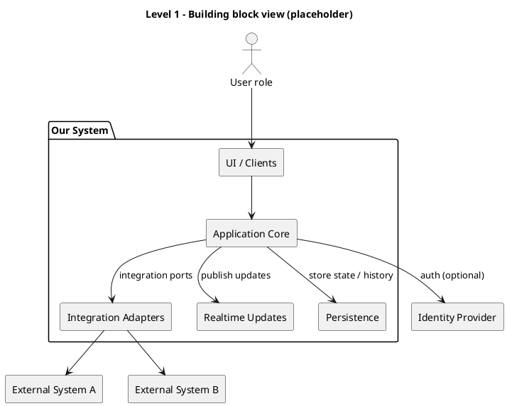
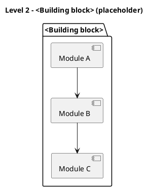

This post is about **chapter 5: Building block view**,
the second chapter in the "How is it built and how does it work" group.

Chapter [4][CH4] set direction; chapter 5 makes it tangible.
Here you describe the **static structure** of the system: the building blocks, what each one is responsible for,
and which dependencies matter.

The goal is not to document everything.
The goal is to give readers a mental map of the solution, so changes and discussions stop happening "in someone’s head".

<!--more-->

> [!NOTE]
> This post is longer because chapter 5 introduces hierarchical decomposition (a.k.a. zooming in step by step):
> start small, and only add detail when it prevents real misunderstandings.

## What belongs in chapter 5 (and what does not)

The main job of chapter 5 of an [arc42][ARC42] document is to answer:

> What are the main parts of the system, and what is each part responsible for?

What belongs here:

- A building block hierarchy (level 1–3), from coarse to detailed.
- Per building block:
  - **responsibility** (one sentence)
  - key **dependencies**
  - main **interfaces** (what it offers/needs)
- The boundaries that matter: ownership, responsibilities, and "who is allowed to change what".
  When multiple teams work on the same system, building block boundaries often align with team ownership.
  If changing a block requires coordination with another team, that boundary is worth documenting.
- The structural consequences of your strategy from chapter [4][CH4]
  (e.g., modular monolith vs distributed, having a BFF, etc.).
- Links to source code or generated docs when that helps (if building blocks map to modules/packages/repos).

What does not belong here:

- Copy/pasting large parts of earlier chapters.  
  Refer back to the goals, constraints, and context when you need them,
  but keep this chapter focused on responsibilities and boundaries.
- Step-by-step flows, sequencing, or "and then it calls X" stories.  
  This chapter is about static structure, not behavior.
- Environment-specific deployment and infrastructure details.  
  Keep those concerns separate so the building block view stays stable even when environments change.
- Full interface specifications and contract catalogs.  
  You can link to OpenAPI/AsyncAPI or other specs, but avoid duplicating payloads and edge cases here.
- Low-level implementation decisions that change frequently.  
  If it is likely to flip during sprints (a library choice, an internal pattern tweak),
  it does not belong in the core structure.

### The "white-box" metaphor

The core concept of this chapter is the **black-box vs. white-box** approach.

- **Chapter [3][CH3]** was the **black-box** view: The system is a sealed opaque block.
  We only described what crosses the boundary (interfaces) and who sits outside (neighbors),
  but internals were invisible (hence "black" or opaque).
- **Chapter 5** is the **white-box** series:
  We "open the lid" of the system. We look inside to see how it is constructed.

Level 1 opens the main black box. If a component inside Level 1 is complex,
we treat _that_ component as a black box first, then open it up in Level 2 (its white-box view).
This hierarchical decomposition is standard in [arc42][ARC42] and aligns with the [C4 Model][C4] "Zoom" concept.

### Levels mean different things in different documents

**First, a blunt disclaimer:** The building block levels are a **zoom tool**, not a fixed taxonomy.
You stop decomposing when you can no longer explain why the detail matters to your architectural goals.

What "level 1–3" means depends on what you are documenting:

- For a large system, level 1 might be products, level 2 domains/services, and level 3 microservices.
- For a single (micro)service, level 1 might be the service boundary, level 2 internal modules, and level 3 namespaces.
- For a platform/library team, level 2 might describe public APIs or even classes,
  because that is what stakeholders integrate with,
  and level 3 might be implementation details that only the owning-team needs to understand.

> [!TIP]
> Pick the level of detail that matches your stakeholders.
> A diagram is successful when it answers their questions, not when it contains more boxes.

### Level 1 should match chapter 3

Level 1 is where you show the **system boundary** and the **neighbors**.
It should include the same external neighbors you introduced in chapter [3][CH3].

> [!WARNING]
> **Do not confuse context with building blocks.**
>
> - **Chapter 3**: _Who/what is outside, and what crosses the boundary?_
> - **Chapter 5 Level 1**: _What are the main internal building blocks,
>   and how do they depend on each other and their connection to the external neighbors?_

That creates a nice "thread" through the document:

- chapter [3][CH3]: _who we interact with_
- chapter 5: _how we are structured to deal with that_
- chapter 6: _how the collaboration plays out at runtime_ (spoiler alert! 🫣)

### Do not repeat interface details on every level

Interfaces show up on multiple levels, but you do not have to repeat everything.
Repeating payloads and contracts at every zoom level creates noise and maintenance debt.

A practical rule:

- **Level 1:** Name the interactions (e.g., "Appointments", "Status Updates") so the relationship is clear.
- **Level 2/3:** Document the interface _where the contract lives_ (e.g., in the integration module or port)
  and link to the source/spec.

When you are describing interfaces on a level, it could be helpful to separate them into:

- **external interfaces** (tie back to chapter [3][CH3])
- **internal interfaces** (boundaries between your own building blocks,
  e.g. a frontend-backend API or a module's public API)

## The minimum viable version

If you are short on time, aim for this:

1. One **level 1** diagram showing the system boundary and all relevant neighbors from chapter [3][CH3].
2. A short table describing each level-1 building block: responsibility + key dependencies.
3. Optionally: one **level 2** zoom for the one area that is complex or risky.

Then stop. 🛑

## Copy/paste structure (Markdown skeleton)

Use this as a starting point and keep it small.

````md title="05-building-block-view.md"
## 5. Building block view

### 5.1 Level 1: White-box overall system

<Short explanation: what are the major building blocks and why this decomposition?>



<How to read this diagram:
boxes = responsibilities/ownership,
arrows = dependencies (not runtime sequence),
labels = intent (not necessarily protocol).>

#### Building blocks (level 1)

| Building block | Responsibility | Depends on | Notes |
| :------------- | :------------- | :--------- | :---- |
| ...            | ...            | ...        | ...   |

#### External interfaces (optional)

| Peer | Interface | Direction | Protocol/Format | Where documented |
| :--- | :-------- | :-------- | :-------------- | :--------------- |
| ...  | ...       | ...       | ...             | chapter 3 / spec |

#### Internal interfaces (optional)

| Between | Interface | Purpose | Notes |
| :------ | :-------- | :------ | :---- |
| ...     | ...       | ...     | ...   |

### 5.2 Level 2: <Building block> (only where it matters)

<Zoom into one block that is risky/complex. Keep it a white-box view.>



### 5.3 Level 3: <Optional deeper zoom>

<Only when your stakeholders need it: namespaces, packages, public APIs, or even classes.
For example, if a level-2 module has a complex internal structure that other teams integrate with,
zooming in to show its public API surface and internal layering can prevent misunderstandings.>

<Consider linking to source code / generated docs when available.>
````

> [!TIP]
> If building blocks map cleanly to code, link them.
> Some teams generate docs straight from source ([Doxygen][DOXYGEN]-style or similar),
> which can make this chapter accurate and cheap to maintain.

## Example (Pitstop)

Pitstop is my small demo system for this series.
It is intentionally simple, so the documentation stays shareable.

This is what chapter 5 looks like when filled in.

> ## 5. Building block view
>
> ### 5.1 White-box overall system
>
> 
>
> **Building blocks (level 1)**
>
> | Block              | Responsibility                                   | Key Interfaces                               |
> | ------------------ | ------------------------------------------------ | -------------------------------------------- |
> | Admin Overview UI  | Dashboard, coordination, customer comms support  | HTTPS/JSON to Backend                        |
> | Workshop View UI   | Bay/task board, fast updates, degraded mode      | WebSocket/JSON to Backend                    |
> | Backend            | Core domain + APIs + orchestration               | HTTPS/JSON + WS + internal module interfaces |
> | Sync & Integration | Mapping + sync strategy per planning vendor      | REST/JSON, webhooks, retry                   |
> | Audit/Event Log    | Immutable history for accountability + analytics | Append/read APIs                             |
> | DB                 | Operational persistence                          | SQL (implementation-specific)                |
>
> ### 5.2 Level 2 — Pitstop Backend
>
> 
>
> **Notes**
>
> - Modules contain domain rules.  
>   The Integration Ports (a ports-and-adapters pattern, as chosen in chapter [4][CH4])
>   isolate vendor protocols and mapping, so domain modules do not depend on external systems directly.
> - Reporting read models can be optimized independently (avoid OLTP pain).
>
> #### Building blocks (level 2)
>
> | **Element**             | **Responsibility**               | **Depends on**    |
> | :---------------------- | :------------------------------- | :---------------- |
> | Work Order Module       | Core logic for orders            | Customer, Audit   |
> | Workshop Module         | Mechanic task management         | WorkOrders, Audit |
> | Admin Module            | Configuration & overrides        | Audit             |
> | Customer/Vehicle Module | Shared entity data               | Audit             |
> | Reporting               | Read-optimized views             | (Domain Events)   |
> | Planning Port           | Adapter for Planning Service     | External          |
> | Notification Port       | Adapter for Notification Service | External          |
> | Audit Writer            | Centralized compliance logging   | DB                |
> | API Layer               | Protocol handling (HTTP/WS)      | Auth, Modules     |

To browse the full Pitstop arc42 sample, see my [GitHub Gist][PITSTOP_ARC42].

> [!NOTE]
> A level 3 zoom into the Work Order Module could show its internal structure
> (e.g., command handlers, domain entities, validation rules) if stakeholders need that detail.
> For brevity, we leave it out here.

## Common mistakes I see (and made myself)

1. **Too much detail too early**  
   If chapter 5 looks like a class diagram, it will not be maintained.
   Start coarse, and zoom in only where complexity justifies it.

2. **Building blocks without responsibilities**  
   Boxes called <q>Service</q> and <q>Manager</q> are not responsibilities.
   Each block should say what it owns: persistence, state transitions, messaging, integrations, etc.

3. **Mismatch with chapter [3][CH3]**  
   If chapter [3][CH3] lists neighbors, level 1 should show them. As you document the white-box,
   you might find a specific module that talks to an external system you forgot to list in chapter [3][CH3].
   Consistency goes both ways!

4. **Repeating interface specs everywhere**  
   Do not duplicate protocol and payload details on every level.
   Put the detail where it makes sense (often chapter [3][CH3]) and link to it.

5. **Forgetting "source of truth"**  
   For important data: who owns it, and who is allowed to change it?
   If you do not answer this, production will answer it for you.

6. **Using technology names as architecture**  
   <q>Kafka</q> and <q>PostgreSQL</q> are implementation choices.
   Building blocks should describe responsibilities (message bus, persistence, state, integrations),
   so your diagrams remain useful when technology or deployment changes.

## Done-when checklist

🔲 Level 1 includes the system boundary and the neighbors from chapter [3][CH3].  
🔲 Each building block has a clear responsibility in one sentence.  
🔲 External interfaces are referenced (and not duplicated) where documented.  
🔲 Level 2/3 are used only when complexity or stakeholders require it.  
🔲 A new team member can explain "what lives where" after reading this chapter.

## Next improvements backlog

- Add ADR links when boundaries or decomposition are disputed (chapter 9).
- Add level 3 only for a few areas where deeper detail prevents misunderstandings.
- Add links to code/docs where building blocks map cleanly to modules or repos.

## Wrap-up

Chapter 5 is the map. 🗺️  
It helps people find responsibilities, boundaries, and where to implement changes.

Next up: arc42 chapter 6, the runtime view, where we put this structure in motion and describe the most important end-to-end flows.

[PITSTOP_ARC42]: https://gist.github.com/eNeRGy164/90f63e78d3e528f7b8490538a6781b5f
[ARC42]: https://arc42.org/
[C4]: https://c4model.com/
[DOXYGEN]: https://www.doxygen.nl/
[CH3]: /2026/02/04/arc42-chapter-3-context-and-scope/
[CH4]: /2026/02/09/arc42-chapter-4-solution-strategy/
