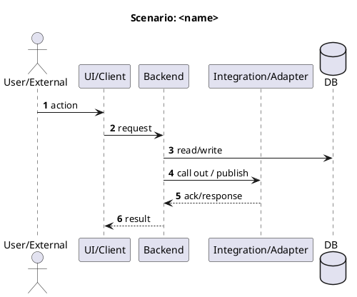

This post is about **chapter 6: Runtime view**,
the last chapter in the "How is it built and how does it work" group.

Chapter [5][CH5] gave us the map (building blocks and responsibilities).
Chapter 6 shows how that map is used in real life: **who talks to whom, in what order, and why**.

The arc42 template keeps this chapter intentionally "empty" by default.
It is basically a container for scenarios: one subchapter per runtime process you want to document.

<!--more-->

> [!NOTE]  
> Chapter 6 can grow a lot. That is not a smell.  
> If users and external neighbors interact with your system, those flows _are_ architecture.

## What belongs in chapter 6 (and what does not)

Chapter 6 of an [arc42][ARC42] document answers:

> How does the system behave at runtime in the scenarios that matter?

What belongs here:

- **All relevant runtime scenarios** where there is meaningful interaction:
  - user interactions that change state or trigger workflows
  - integrations with external neighbors (inbound/outbound)
  - operationally important processes (batch runs, scheduled jobs, import/export)
  - flows that embody key quality goals (latency, availability, auditability, resilience)
- For each scenario: the collaboration between the building blocks (names consistent with chapter [5][CH5]).
- Alternatives and exceptions where they exist:
  timeouts, retries, idempotency, partial failures, degraded/offline behavior, manual fallbacks.
- Notes that help people reason about runtime behavior:
  correlation IDs, observability points, ordering guarantees, consistency expectations.

> [!TIP]  
> If a neighbor appears in the context view (chapter [3][CH3]), try to let it show up in at least one runtime scenario over time.  
> If it never appears, that is useful feedback: maybe it is not a real neighbor, maybe it is background data, or maybe the relevant scenario is still missing.  
> Either way, treat it as a prompt to revisit the context view in your next iteration.

What does not belong here:

- Long descriptions of static responsibilities and decomposition.
  This chapter is about collaboration over time, not "what exists".
- A full contract catalog or protocol reference.
  Link to specs where they live; keep this chapter focused on behavior and responsibilities.
- Environment-specific deployment details.
  The runtime behavior should still make sense even if you deploy differently.
- Low-value diagram noise:
  repeating "return payload" on every arrow when nothing is transformed,
  or expanding every internal hop when it adds no architectural insight.
- **Cross-cutting flows that are the same everywhere**, such as the OAuth/OIDC login flow.
  That belongs in chapter 8 as a reusable concept (unless you are literally building an auth service 😅).

> [!NOTE]
> Runtime view is where architecture stops being a set of boxes
> and becomes a set of promises: "this happens", "this must not happen", "this is how we recover".

## Diagrams (and how to keep them readable)

### Sequence diagrams for sequential flows

Sequence diagrams are excellent at showing **who talks to whom, in what order, and why it matters**.

Focus on what changes to keep diagrams readable:

- **Request/response pairs**  
  Show them only when data transforms or meaning shifts.
  Skip the "return OK" arrows that just echo back what was sent.
- **Internal hops**  
  Compress them when a layer simply passes data through without adding architectural insight.
  Three layers calling each other with identical payloads? Show it as one arrow across the boundary.
- **Scenario intent**  
  Lead with it, not implementation noise.
  Readers should grasp the essential flow in seconds, then dive into details if they need them.

#### Example trade-off

A "create order" scenario does not need you to diagram every internal service call.
Show the user action, the boundary entry point, the database write, and the response back.
Skip the middleware, logging, and validation layers unless they embody a quality goal or failure path.

### BPMN for more complex flows

When scenarios have a lot of branching (alt/if/else), loops, delays, sequence diagrams can become a spaghetti scroll. 🍝

That is where **[BPMN][BPMN]** often shines: it stays readable as complexity grows.
[Camunda Modeler][CAMUNDA_MODELER] is my go-to tool.

Trade-off: BPMN is typically stored as XML, which is not fun to review in a repo.
So exporting diagrams as images becomes an extra step.
Just keep the source file and the exported image together.

> [!TIP]
> You do not need to pick one diagram type for everything.
> Consistency helps, but clarity helps more.

## The minimum viable version

If you are short on time, aim for this:

1. Start with 1–3 scenarios that cross boundaries: user → system and system → neighbor.  
   The first user flow, the first integration, and the first "what if it fails?" path.
2. For each scenario, add:
   - the intention (what we are trying to achieve)
   - the main participants (aligned with chapter [5][CH5])
   - the happy path
   - the first important exception (retry/fallback/manual procedure)
3. Keep the scenario sections small. Grow later.

## Copy/paste structure (Markdown skeleton)

Use this as a starting point. Keep it flexible.

````md title="06-runtime-view.md"
## 6. Runtime view

<If you have a lot of scenarios, add a table of contents here with links to each scenario.>

### 6.n <Scenario name>

<Write a short intro for the scenario. A few lines is enough: what happens, why it matters, and what "done" looks like.>

_Optional prompts you can include (pick what helps):_

- _Intention:_ what are we trying to achieve?
- _Trigger:_ what starts this (user action, event, schedule)?
- _Participants:_ which building blocks and neighbors are involved?
- _Notes:_ assumptions, alternatives, open topics, relevant links (e.g., ADRs, specs, concepts)



**Exceptions and alternatives (optional):**

- <timeout> → <behavior/fallback>
- <partial failure> → <behavior/fallback>
- <manual recovery step> → <who does what>
````

> [!TIP]
> If your chapter becomes large (and it might), group scenarios by theme or functionality:
> "User flows", "Integrations", "Operational jobs", etc.

## Example (Pitstop)

Pitstop is my small demo system for this series.
It is intentionally simple, so the documentation stays shareable.

> ### 6.1 Scenario: Create/update order on appointment import
>
> **Why this scenario matters**
>
> - It hits the core value: planning ↔ execution sync.
> - It exercises consistency, auditability, and integration boundaries.
>
> 
>
> **Failure / exception notes**
>
> - Planning API unavailable → Sync queues outbound updates with retry + backoff.
> - Duplicate appointment updates → idempotency key (appointmentId + version/timestamp).
> - Conflicting edits → "last-write-wins" only for safe fields; status changes may require rules (e.g., foreman override).

To browse the full Pitstop arc42 sample, see my [GitHub Gist][PITSTOP_ARC42].

## Common mistakes I see (and made myself)

1. **Only documenting the happy path**  
   Architecture shows up in failure handling, retries, timeouts, and recovery.

2. **Diagrams that don’t match your building blocks**  
   If names and boundaries differ from chapter [5][CH5], readers lose their mental model.

3. **Diagram noise instead of insight**  
   Do not waste pixels on repetitive returns and unchanged payloads.  
   Compress internal hops when they add no architectural value.

   ```diff
   - User → API → Service → Repository → DB → Repository → Service → API → User
   + User → API → Domain write (DB) → API → User
   ```

4. **Avoiding "big" because it might become big**  
   Documenting 27 scenarios is not wrong.  
   It becomes wrong when nobody can find anything.  
   Group them, index them, or split into linked documents when the system is large.

5. **No external stakeholder recognition**  
   If a neighbor/system owner cannot recognize their part in the flow,
   you probably did not document it clearly enough.

## Done-when checklist

🔲 Relevant user and neighbor interactions are covered (or explicitly postponed).  
🔲 Scenario diagrams use building block names consistent with chapter [5][CH5].  
🔲 Key alternatives/exceptions are documented where they matter.  
🔲 The chapter is navigable: scenarios are grouped and titled clearly.  
🔲 Readers can explain "what happens when…" without guessing.

## Next improvements backlog

- Add scenarios for remaining neighbors until the context view is "explained by runtime".
- Add idempotency/retry rules for integrations that can duplicate messages.
- Add observability notes per scenario (correlation IDs, key logs/metrics).
- Split scenarios into separate linked arc42 documents if the system warrants it.

## Wrap-up

Chapter 6 is where your architecture becomes visible in motion.
With chapters [4][CH4], [5][CH5], and 6, the full **"How is it built and how does it work"** group is complete.

Next up is the **"Rules, decisions, and qualities"** group starting with arc42 chapter 7 "Deployment view",
where we map building blocks onto infrastructure and environments.

[PITSTOP_ARC42]: https://gist.github.com/eNeRGy164/90f63e78d3e528f7b8490538a6781b5f
[ARC42]: https://arc42.org/
[BPMN]: https://www.bpmn.org/
[CAMUNDA_MODELER]: https://camunda.com/download/modeler/
[CH3]: /2026/02/04/arc42-chapter-3-context-and-scope/
[CH4]: /2026/02/09/arc42-chapter-4-solution-strategy/
[CH5]: /2026/02/10/arc42-chapter-5-building-block-view/
