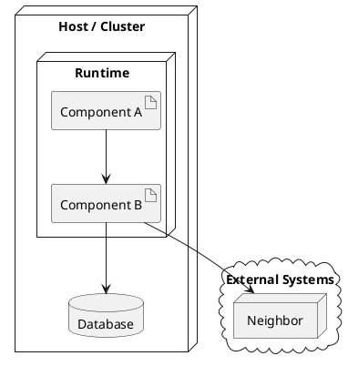

This post is about **chapter 7: Deployment view**,
the last chapter in the "How is it built and how does it run" group.

Small milestone: chapter 7 means we are **past the halfway point** of the 12 arc42 chapters.

Chapter [5][CH5] gave us the map (building blocks).
Chapter [6][CH6] showed how those blocks collaborate at runtime.
Chapter 7 answers the next question: _where_ do those blocks run, _in which environments_, and _with which settings_?

<!--more-->

> [!NOTE]
> This chapter turns "it works on my machine" from tribal knowledge into shared documentation.
> No more guessing which settings matter or where things actually run.
>
> Also: "my machine" can be a perfectly valid environment.
> If onboarding and local dev matter, document that setup as a real deployment variant.

## What belongs in chapter 7 (and what does not)

The main job of chapter 7 of an [arc42][ARC42] document is to answer:

> Where does the system run, how is it wired, and what needs to be configured to make it behave correctly?

What belongs here:

- A deployment overview of **nodes, environments, and their connections**.
  Think: hosts, clusters, networks, segments, and the paths between them.
- A mapping from **building blocks to infrastructure**:
  which blocks run where, and which ones are "shared" vs "per environment/per site".
- The **runtime configuration** that is required to run the system and that changes behavior:
  environment variables, config files, feature flags, connection strings, default values, and required secrets (at least at a reference level).
- Operational concerns that affect how the system holds up:
  what scales, what is isolated, what happens when a node goes down.
- **Trust boundaries and data classification**:
  which networks are public vs. private, and where sensitive data is allowed to live.
- **Persistence strategy**:
  especially for containerized setups, explicitly state where state lives (volumes, managed databases) and if it is backed up.
- Quality and/or performance features of the infrastructure when they matter:
  expected throughput, latency constraints, availability targets, bandwidth limitations, or time synchronization (NTP) requirements.
- Links to deployment assets when they are the source of truth:
  Dockerfiles, Helm charts, Kustomize overlays, Terraform/Bicep/ARM, compose files, install scripts, etc.
  If your base image choice matters (for size, security, or compliance), add a short note on why.

> [!TIP]
> If you have full Infrastructure as Code (IaC), Chapter 7 is the map; your Terraform or Bicep is the construction crew.
> Do not duplicate every setting from your IaC here. Instead, explain the topology that the code creates.

What does not belong here:

- A full re-explanation of your building blocks or domain responsibilities.
  This chapter is about _placement_ and _wiring_, not reintroducing the system.
- Detailed runtime scenarios ("and then it calls X") unless the scenario is _specifically about deployment behavior_
  (e.g., failover sequence, blue-green switch, cold start, disaster recovery).
- Interface payload catalogs and protocol specs.
  Link to where contracts live, and keep chapter 7 focused on infrastructure and configuration.
- A giant unstructured dump of "every setting we ever had" without context.
  Configuration belongs here, but it needs a structure: defaults, required vs optional, and what it influences.

### Where to document configuration

> [!NOTE]
> Strictly speaking, arc42 does not prescribe a configuration section in chapter 7.
> The template typically places the _what_ of a setting (meaning, default, contract) in chapter 5 (building block interfaces)
> and the _how_ (override strategy, config patterns) in chapter 8 (crosscutting concepts).
> Chapter 7 itself only covers the _where_: which node, which manifest, which secret store.

I prefer to consolidate configuration in chapter 7.
When a newcomer asks "what do I need to configure to make this run?",
I want the answer to be in one place, right next to the infrastructure it runs on.
Splitting it across chapters 5, 7, and 8 is structurally clean but practically hard to navigate.

If you have a separate place where configuration is documented (runbook, ops handbook, generated config reference),
link to it and keep chapter 7 as the _map_.

If you **do not** have a separate configuration reference, chapter 7 is a practical home for it:
everything needed to make the application run, and everything that changes behavior per environment.

That usually includes:

- environment variables and configuration keys
- config files and naming conventions (`appsettings.{Environment}.json`, `.env`, mounted files, etc.)
- default values
- "required in production" vs "optional"
- where it is set (deployment manifest, secret store, CI variables)
- what it impacts (behavior, performance, safety, compliance)

> [!WARNING]  
> **Never** document actual secret values (API keys, passwords, connection strings) in this chapter.
> Only document the _names_ of the secrets or which vault they live in.  
> If I see a potential password in a markdown file, I will find you! 👮‍♂️😉

A practical structure that stays readable:

- a short "configuration model" section (how config is loaded/overridden)
- a table of key settings (only the ones that matter)
- links to the "full reference" if/when you have one

## The minimum viable version

If you are short on time, aim for this:

1. One main deployment diagram for the most important environment (often production-like).
2. A short mapping table: which building blocks run where.
3. A small "runtime configuration" section:
   the 5–15 settings that decide behavior, plus where they live.

That is already enough to stop most "but it worked yesterday" surprises.

## Copy/paste structure (Markdown skeleton)

Sections 7.1 and 7.2 follow arc42's infrastructure levels.
I add a dedicated configuration section per infrastructure element;
arc42 would split that across chapters 5 and 8 (see [the note above](#where-to-document-configuration)).

For multiple environments, arc42 suggests copying the 7.1 structure.
Keep it small and add depth only when it matters.

````md title="07-deployment-view.md"
## 7. Deployment view

<Short intro: what environments exist and what matters operationally?>

### 7.1 Infrastructure Level 1

<Diagram: nodes, connections, trust boundaries, and where blocks run.>



#### Motivation

<Why this deployment topology? What drove the decisions?>

#### Quality and/or performance features (optional)

<Relevant infrastructure qualities: throughput, latency, availability, bandwidth.>

#### Mapping (what runs where)

| Building block | Runs on | Notes |
| :------------- | :------ | :---- |
| ...            | ...     | ...   |

### 7.2 Infrastructure Level 2 (optional)

<Zoom into specific infrastructure elements from Level 1 that need more detail.>

#### 7.2.1 <Infrastructure element>

<Internal structure, operational details for this element.>

##### Configuration

<Runtime configuration for components running on this element.
arc42 would place setting definitions in chapter 5 and the override strategy in chapter 8;
I keep them here so everything needed to deploy lives in one place.>

| Key / setting | Default | Required | Where set | What it influences |
| :------------ | :------ | :------- | :-------- | :----------------- |
| ...           | ...     | ...      | ...       | ...                |
````

## Example (Pitstop)

Pitstop is my small demo system for this series.
It is intentionally simple, so the documentation stays shareable.

This is what chapter 7 looks like when filled in.

> ## 7. Deployment view
>
> ### 7.1 Infrastructure Level 1 - Single garage
>
> _Situation:_ one garage runs Pitstop on-prem on a single Docker host;
> the UIs and backend run as containers next to the database.
>
> 
>
> #### Motivation
>
> Small garages need a self-contained setup that works on a single machine
> without external dependencies. All components share one host to keep
> operations simple.
>
> #### Mapping
>
> | Building block              | Runs on          | Notes                     |
> | :-------------------------- | :--------------- | :------------------------ |
> | Workshop Management Service | Docker container | Main backend              |
> | Customer Management Service | Docker container | Shares host with backend  |
> | Pitstop UI                  | Docker container | Served via reverse proxy  |
> | SQL Database                | Docker container | Persistent volume on host |
> | Message Broker              | Docker container | RabbitMQ, single node     |
>
> ### 7.1 Infrastructure Level 1 - Multi-site
>
> _Situation:_ a garage chain wants central reporting and audit,
> but each site needs fast workshop responsiveness even with shaky connectivity.
>
> - Central DB + audit store; site-level caches for workshop responsiveness.
> - Reporting can run off read replicas.
>
> #### Motivation
>
> Garage chains need central reporting and audit, but the workshop still
> needs to feel fast locally. Sites must keep working even when
> connectivity to the central system is unreliable.
>
> #### Mapping
>
> | Building block              | Runs on          | Notes                                      |
> | :-------------------------- | :--------------- | :----------------------------------------- |
> | Workshop Management Service | Site Docker host | Local-first, syncs to central              |
> | Customer Management Service | Central cluster  | Shared across sites                        |
> | Pitstop UI                  | Site Docker host | Served locally for responsiveness          |
> | SQL Database                | Central cluster  | Primary store, replicas per site           |
> | Message Broker              | Central cluster  | Federated; site-level queue for resiliency |
> | Reporting Service           | Central cluster  | Reads from replicas                        |
> | Audit/Event Log             | Central cluster  | Append-only, retained centrally            |
>
> #### Operational notes
>
> - Monitoring: request latency, WS connection health, sync queue depth, retry rate.
> - Backups: DB daily + audit log retention policy.
> - Security: network segmentation; outbound allowlist to planning/PSP endpoints.
>
> ### 7.2 Infrastructure Level 2
>
> #### 7.2.1 Docker host
>
> Single Linux host running Docker Engine.
> All Pitstop containers and the database run here.
> Images are built with multi-stage Dockerfiles to keep the final image small and free of build tooling.
>
> ##### Configuration
>
> Pitstop behavior differs per garage and network reliability.
> These settings are owned by Ops and injected via container environment variables
> or mounted config files.
>
> **Key setting: `ConnectivityMode`**
>
> - `OnlineFirst` (default): normal operation, real-time updates preferred
> - `OfflineFirst`: prioritize local queueing + aggressive retries (workshop-heavy garages / flaky Wi-Fi)
>
> **Where configured**
>
> - container env var `Pitstop__ConnectivityMode` or `appsettings.{Environment}.json`
>
> ```json
> // appsettings.Production.json
> {
>   "Pitstop": {
>     "ConnectivityMode": "OfflineFirst",
>     "Realtime": {
>       "Transport": "WebSocket",
>       "FallbackToPollingSeconds": 5
>     },
>     "Sync": {
>       "RetryPolicy": "ExponentialBackoff",
>       "MaxRetries": 10
>     }
>   }
> }
> ```

To browse the full Pitstop arc42 sample, see my [GitHub Gist][PITSTOP_ARC42].

## Common mistakes I see (and made myself)

1. **Only drawing "prod" and ignoring "dev"**
   If local dev and onboarding matter, treat them as a real deployment variant.
   It does not have to be pretty, it has to be accurate.

2. **Mixing behavior and placement**
   Chapter 7 is where things run and how they connect.
   Behavior generally belongs in runtime scenarios (chapter [6][CH6]).
   Deployment-driven behavior (failover, DR, scaling) should be documented either here (when it depends on topology/environment) or in chapter 8 (when it is a reusable concept/pattern).

3. **Configuration without structure**
   A thousand keys in a wall of text is not documentation, it is punishment.
   Group by domain/feature, document defaults, and call out which values change behavior.

4. **Forgetting operational boundaries**
   Who owns what? Which node is "managed by ops" vs "managed by the team"?
   Which dependencies are inside your control, which are not?

5. **No traceability to building blocks**
   If readers cannot map a box in the diagram back to a building block from chapter [5][CH5],
   the deployment view becomes "a nice picture" instead of a useful model.

## Done-when checklist

🔲 The main environments/variants are described (or explicitly out of scope).  
🔲 Building blocks are mapped to nodes/locations.  
🔲 Key runtime configuration is documented: defaults, where set, and what it changes.  
🔲 Operational concerns are at least acknowledged (monitoring, backups, security boundaries).  
🔲 A newcomer can answer: "where does this run?" and "what do I need to configure?"

## Next improvements backlog

- Add an explicit mapping table for each relevant environment or variant.
- Link the actual deployment assets (Dockerfile, Helm, Terraform, compose) where appropriate.
- Add a small "secrets and trust boundaries" note (what must be protected, where it lives).
- Add operational SLO/SLA expectations if availability and latency are key goals.

## Wrap-up

Chapter 7 is the reality check: the system, placed on real infrastructure with real constraints.
It is where "works in my head" becomes "works in an environment".

With chapter 7 done, the full **"How is it built and how does it run"** group is complete.

Next up is the **"Reusables, decisions, and qualities"** group, starting with arc42 chapter 8, "Concepts",
where we document the reusable cross-cutting ideas (auth, logging, error handling) without duplicating them in every scenario.

[PITSTOP_ARC42]: https://gist.github.com/eNeRGy164/90f63e78d3e528f7b8490538a6781b5f
[ARC42]: https://arc42.org/
[CH5]: /2026/02/10/arc42-chapter-5-building-block-view/
[CH6]: /2026/02/11/arc42-chapter-6-runtime-view/
